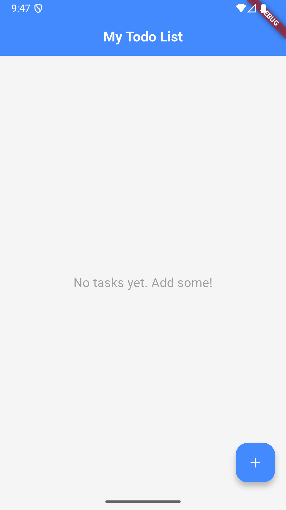
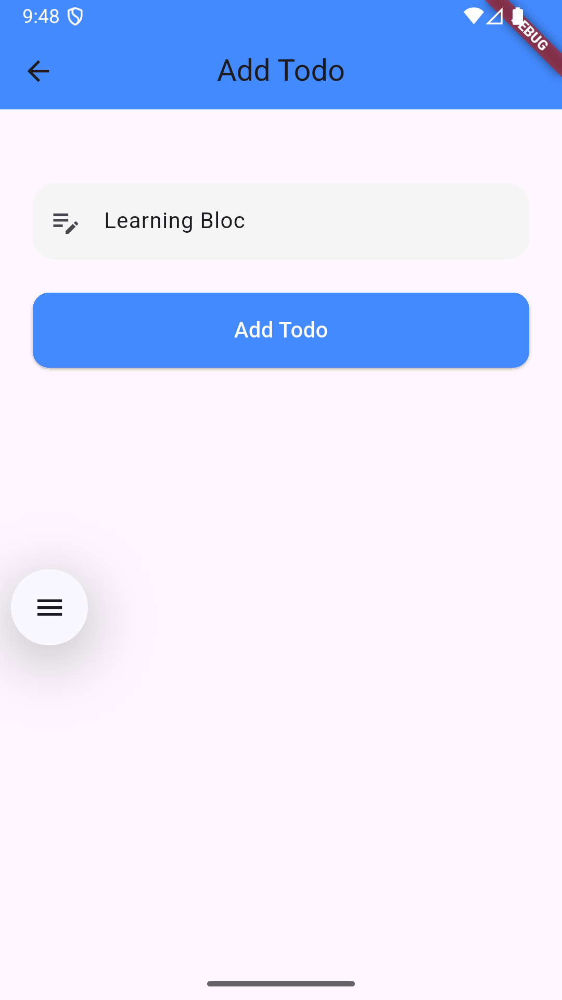
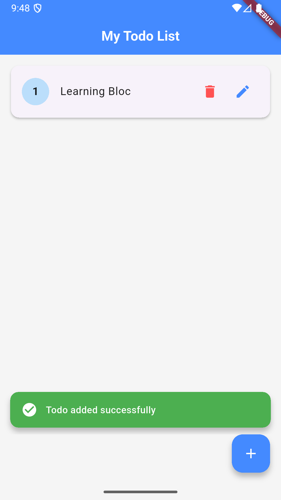
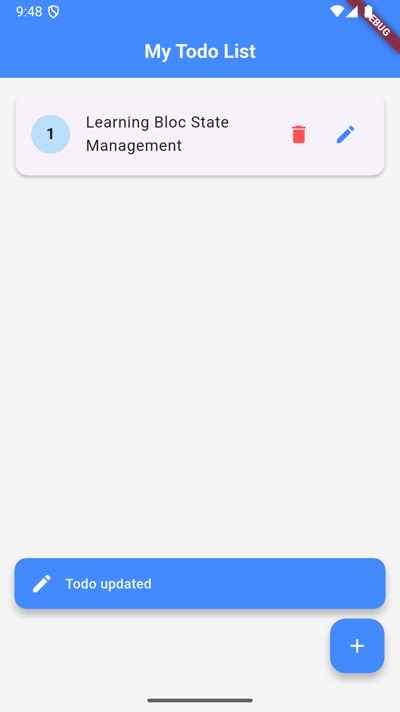
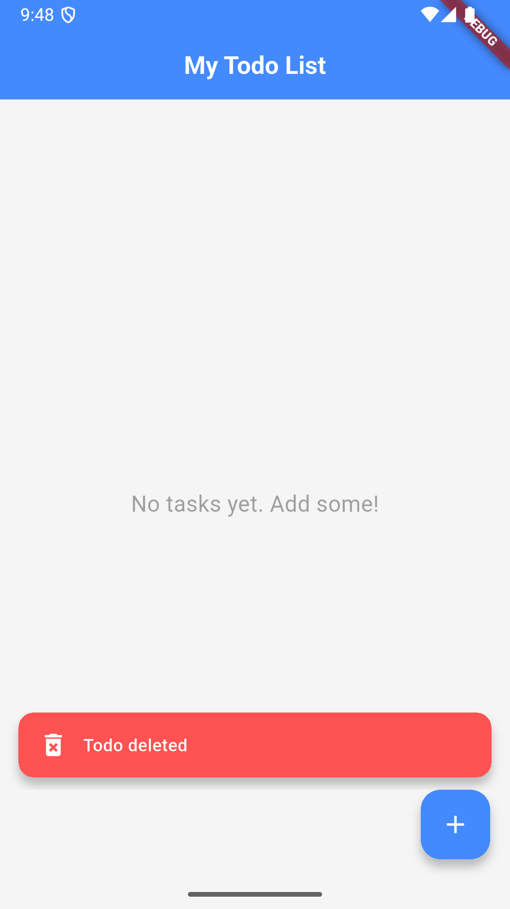

# 📝 Flutter Todo App using BLoC State Management

A simple and clean **Todo Application** built with **Flutter** and **BLoC state management**, featuring Add, Update, and Delete functionalities with Snackbar notifications.

---

## About this Project

This Todo App was created as a hands-on learning project to deepen my understanding of Flutter and the BLoC state management pattern.

During development, I explored:  
- Managing complex state using events and states in BLoC  
- Reactive UI updates with `BlocBuilder`  
- Navigation and data passing between screens  
- Providing user feedback with styled SnackBar notifications  
- Writing clean, maintainable, and scalable Flutter code  

This project helped me build confidence in architecting Flutter apps following best practices.

---

## 🚀 Features
- Add new Todo items  
- Update existing Todo items  
- Delete Todos  
- Snackbar notifications for actions (Added / Updated / Deleted)  
- Clean and maintainable code using BLoC pattern  

## 📸 Screenshots
### 🏠 Home Screen


### ➕ Add Todo


### ✏️ Update Todo


### ✅ Todo Added


### ♻️ Todo Updated


### ❌ Todo Deleted


## 🛠 Tech Stack
- **Framework:** Flutter
- **State Management:** flutter_bloc
- **Language:** Dart
- **UI:** Material Design

---

## 📦 Installation & Setup
```bash
# Clone the repository
# Navigate into the project directory

# Install dependencies
flutter pub get

# Run the app
flutter run

## 📂 Project Structure
lib/
├── bloc/
│ ├── todo_bloc.dart
│ ├── todo_event.dart
│ └── todo_state.dart
├── self_todo/
│ ├── self_todo_screen.dart
│ ├── add_todo_item.dart
│ └── update_todo_item.dart
└── main.dart
